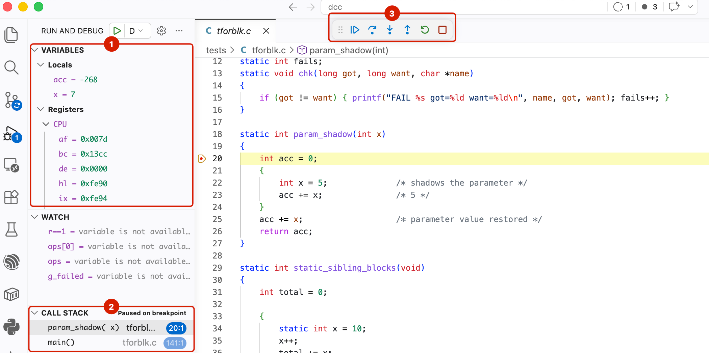
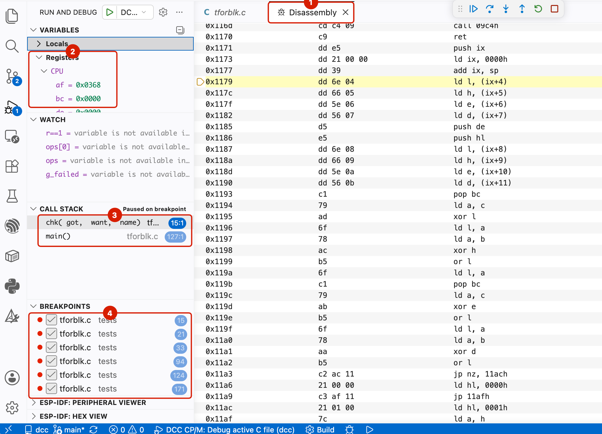

# VS Code debugging

DCC source debugging is available in Visual Studio Code through the Microsoft
C/C++ extension and `dcc-debug-host`'s GDB/MI interface. A debug build produces
a CP/M `.COM` program and a matching `.DBG` metadata file. `dcc-debug-host`
boots CP/M, runs the program, and presents source, stack, variables, memory,
and Z80 instructions to VS Code.

For the most accurate source-level experience, use the default no-peep debug
build. Optimized debug builds are also available for defects that reproduce
only after peephole optimization, with the limitations described below.

See [Debugger host and I/O adapters](00-debug-host.md) for the full-system
architecture, target terminal, dynamic I/O adapter, and terminal pipeline.



## How debugging works

The debugger uses four cooperating pieces:

1. `dccmake -g` invokes DCC with debug metadata enabled for every C source in
   the program. DCC writes source, function, variable, type, and scope markers
   into the generated assembly.
2. Native `m80c` assembles each module and records those markers as
   segment-relative metadata in a per-module `.DBG` file.
3. `dccmake` links the program and writes one final `DCCDBG 2` file whose
   addresses match the linked `.COM` image.
4. `dcc-debug-host` boots CP/M, loads the `.COM` and adjacent `.DBG`, exposes
  them through GDB/MI, and the VS Code C/C++ extension presents that
  information as source breakpoints, stepping, stack frames, variables,
  watches, memory, and Z80 disassembly.

The project does **not** need a hand-written `.DBG` file. It may need a
`dccmake.txt` file to describe how the program is built; the debug metadata
itself is generated automatically.

## Prerequisites

Before configuring a project:

1. [Build and configure the DCC toolchain](00-setup-toolchain.md). The normal
  `scripts/build-dcc.ps1` build includes `dcc-debug-host`.
2. Install the [Microsoft C/C++ extensions for VS Code](https://marketplace.visualstudio.com/items?itemName=ms-vscode.cpp-devtools){: target="_blank" }.
3. Make `dccmake` available on `PATH`, or use its absolute path in the build
   task.
4. Make sure `dccmake` can find `dcc`, `dccpeep`, `dccrtlstrip`,
   [`m80c`](appendix/03-utilities.md#native-assembler-m80c),
   `DCCRTL.MAC`, and the configured linker as described on
   [The toolchain](00-setup-toolchain.md).

Debug metadata requires the native
[`m80c`](appendix/03-utilities.md#native-assembler-m80c) assembler. Do not set
`dcc-use-emulated-m80=true` for a debug build.

Source and output names must also satisfy CP/M 8.3 naming rules. In particular,
`dcc-output` is at most eight characters and has no extension.

## Add debugging to a project

A project needs three configuration files in addition to its C sources:

```text
my-project/
├── .vscode/
│   ├── launch.json
│   └── tasks.json
├── dccmake.txt
├── main.c
└── module.c
```

Build DCC once with `scripts/build-dcc.ps1`, then set `DCC_DIR` in the
environment inherited by VS Code to the DCC repository directory. For example,
on macOS or Linux:

```sh
export DCC_DIR="$HOME/GitHub/dcc"
code my-project
```

In PowerShell on Windows:

```powershell
$env:DCC_DIR = "C:\GitHub\dcc"
code my-project
```

### Add `dccmake.txt`

This example builds two translation units as `build/PROGRAM.COM` and writes the
matching metadata as `build/PROGRAM.DBG`:

```text
dcc-input=main.c,module.c
dcc-output=PROGRAM
dcc-build-dir=build
dcc-stack-bytes=1024
```

Replace the source list, output name, and stack size with the project's actual
values. The output name must fit CP/M's eight-character basename limit.

### Add `.vscode/tasks.json`

The build task runs `dccmake -g` from the project root. `dccmake` reads the
adjacent `dccmake.txt` and generates both required debug artifacts:

```json
{
  "version": "2.0.0",
  "tasks": [
    {
      "label": "Build DCC program for debugging",
      "type": "shell",
      "command": "${env:DCC_DIR}/dccmake",
      "args": ["-g"],
      "options": {
        "cwd": "${workspaceFolder}"
      },
      "problemMatcher": []
    }
  ]
}
```

### Add `.vscode/launch.json`

The launch configuration points VS Code at the `.COM` file and uses
`dcc-debug-host` as its GDB/MI executable. Keep `program` synchronized with
`dcc-output` in `dccmake.txt`:

```json
{
  "version": "0.2.0",
  "configurations": [
    {
      "name": "DCC CP/M: Debug PROGRAM",
      "type": "cppdbg",
      "request": "launch",
      "preLaunchTask": "Build DCC program for debugging",
      "program": "${workspaceFolder}/build/PROGRAM.COM",
      "cwd": "${workspaceFolder}/build",
      "MIMode": "gdb",
      "miDebuggerPath": "${env:DCC_DIR}/dcc-debug-host",
      "miDebuggerArgs": "--interpreter=mi",
      "windows": {
        "miDebuggerPath": "${env:DCC_DIR}/dcc-debug-host.exe"
      },
      "targetArchitecture": "x86",
      "sourceFileMap": {
        "${workspaceFolder}/build": "${workspaceFolder}"
      },
      "launchCompleteCommand": "exec-continue",
      "externalConsole": false
    }
  ]
}
```

`sourceFileMap` maps paths reported relative to the `.COM` directory back to
the project root. It also handles source subdirectories: a recorded `src/foo.c`
resolves through `build/src/foo.c` and maps to `src/foo.c` in the project.

Select **DCC CP/M: Debug PROGRAM** in **Run and Debug**, set a source
breakpoint, and press **F5**.

### What happens after F5

1. VS Code runs the pre-launch task, and `dccmake -g` creates a matched `.COM`
   and `.DBG` pair.
2. The C/C++ extension starts `dcc-debug-host` and communicates with it using
   GDB/MI. No separate GDB installation is used.
3. The host boots its CP/M 2.2 system, stages the selected program on its
   disposable B: drive, and launches it at the normal CP/M transient-program
   address.
4. The host translates VS Code breakpoints, stepping, variable requests,
   memory access, and disassembly requests through the linked `.DBG` metadata.
5. Program output appears in the Debug Console. On normal exit, the program
   returns to CP/M and the debug session reports completion.

The `.COM` contains the executable Z80 program; the `.DBG` sidecar is debugger
metadata and is not copied to CP/M hardware. Both files must remain adjacent
and come from the same build.

### Use an I/O adapter

An I/O adapter is optional. It supplies machine-specific ports, terminal
translation, or interrupt sources that are not part of generic CP/M. The normal
DCC build publishes an example adapter beside `dcc-debug-host`. Replace the
launch configuration's `miDebuggerArgs` and Windows override with:

```json
"miDebuggerArgs": "--interpreter=mi --io-adapter \"${env:DCC_DIR}/libdcc-debug-io-adapter-example.dylib\"",
"linux": {
  "miDebuggerArgs": "--interpreter=mi --io-adapter \"${env:DCC_DIR}/libdcc-debug-io-adapter-example.so\""
},
"windows": {
  "miDebuggerPath": "${env:DCC_DIR}/dcc-debug-host.exe",
  "miDebuggerArgs": "--interpreter=mi --io-adapter \"${env:DCC_DIR}/dcc-debug-io-adapter-example.dll\""
}
```

The example adapter provides polling timers and a periodic interrupt source;
see the [timer](12-examples.md#waiting-for-an-io-adapter-timer) and
[interrupt](12-examples.md#handling-periodic-io-adapter-interrupts) programs.
For a custom adapter, substitute its shared-library path and add `--env-file`
if that adapter consumes project configuration. See
[Debugger host and I/O adapters](00-debug-host.md) for the adapter contract.

## Configure the project build

`dccmake.txt` is optional for a standalone source file, but recommended for a
real application. Use it whenever the debug build needs information that cannot
be inferred from the active file, including:

- more than one C translation unit;
- an output name different from the source basename;
- a non-default stack size;
- compiler definitions, include directories, or floating-point I/O options;
- explicit runtime or tool paths; or
- other application-specific `dccmake` settings.

`dccmake` reads `dccmake.txt` from its current working directory. A typical
project file is:

```text
dcc-input=main.c,module.c
dcc-output=PROGRAM
dcc-build-dir=build
dcc-stack-bytes=1024
dcc-peep=true
```

`dcc-input` must list every C translation unit needed by the link. `dcc-output`
controls the basename of both final artifacts:

```text
build/PROGRAM.COM
build/PROGRAM.DBG
```

Command-line values override file values. The VS Code task passes `-g`; the
project file does not need a separate debug setting. Although a normal build
may set `dcc-peep=true`, `dccmake -g` skips `dccpeep` unless
`dcc-peep-debug=true` is explicitly requested.

For a program whose full no-peep debug image is too large, set:

```text
dcc-debug=lines
```

This project setting refines the generic `-g` supplied by the VS Code task. It
uses normal optimized compiler and peephole output while emitting line and
function tables. The resulting `.COM` is byte-identical to a release build;
locals, globals, structures, and variable watches are intentionally omitted.

## Add the build task

For a project with `dccmake.txt`, create `.vscode/tasks.json` and run
`dccmake` from the active source directory so it finds that file:

```json
{
  "version": "2.0.0",
  "tasks": [
    {
      "label": "Build active DCC C file for debugging",
      "type": "shell",
      "command": "dccmake",
      "args": ["-g"],
      "options": {
        "cwd": "${fileDirname}"
      },
      "problemMatcher": []
    }
  ]
}
```

Replace `dccmake` with an absolute path if it is not on `PATH`. For a standalone
file with no `dccmake.txt`, pass the active source and output explicitly:

```json
"args": [
  "-g",
  "dcc-input=${file}",
  "dcc-output=${fileBasenameNoExtension}",
  "dcc-build-dir=build"
]
```

The active editor file is not necessarily the program's main module. When a
`dccmake.txt` file exists, its `dcc-input` list remains authoritative.

## Keep the COM and DBG files paired

`dcc-debug-host` derives the metadata filename from the program filename. If
VS Code loads `PROGRAM.COM`, the host looks for `PROGRAM.DBG` in the same
directory. The files must:

- have identical basenames;
- be adjacent;
- come from the same debug build; and
- not be mixed with stale output from an earlier link.

The launch configuration may load the pair directly from the build directory.
If a shared active-file launch configuration instead expects the source
basename, copy or rename **both** files. For example, if `CHATC11.C` has
`dcc-output=CHAT`:

```sh
cp build/CHAT.COM CHATC11.COM
cp build/CHAT.DBG CHATC11.DBG
```

Copying only the `.COM`, or assuming that `dcc-output` always equals the active
source basename, causes the pre-launch task or metadata load to fail.

For the active-file launch configuration below, add a copy task and a compound
pre-launch task. This macOS/Linux example assumes `dcc-output=PROGRAM`; use
PowerShell `Copy-Item` commands for the equivalent Windows task:

```json
{
  "label": "Copy DCC debug outputs beside source",
  "type": "shell",
  "command": "cp -f \"${fileDirname}/build/PROGRAM.COM\" \"${fileDirname}/${fileBasenameNoExtension}.COM\" && cp -f \"${fileDirname}/build/PROGRAM.DBG\" \"${fileDirname}/${fileBasenameNoExtension}.DBG\"",
  "options": {
    "cwd": "${fileDirname}"
  },
  "problemMatcher": []
},
{
  "label": "Build and copy DCC program for debugging",
  "dependsOrder": "sequence",
  "dependsOn": [
    "Build active DCC C file for debugging",
    "Copy DCC debug outputs beside source"
  ],
  "problemMatcher": []
}
```

Replace `PROGRAM` with the `dcc-output` value. In a workspace containing many
applications, the copy task may read `dcc-output` from each directory's
`dccmake.txt` instead of hard-coding it.

Build the debugger host and add it to the compound pre-launch task:

```json
{
  "label": "Build DCC debugger host",
  "type": "shell",
  "command": "pwsh ./scripts/build-dcc.ps1",
  "options": {
    "cwd": "${workspaceFolder}"
  },
  "problemMatcher": ["$gcc"]
},
{
  "label": "Prepare active DCC program for debugging",
  "dependsOrder": "sequence",
  "dependsOn": [
    "Build and copy DCC program for debugging",
    "Build DCC debugger host"
  ],
  "problemMatcher": []
}
```

## Add the launch configuration

Create `.vscode/launch.json` with the following configuration. On Windows, use
`${workspaceFolder}/dcc-debug-host.exe` for `miDebuggerPath`.

```json
{
  "version": "0.2.0",
  "configurations": [
    {
      "name": "DCC CP/M: Debug active C file",
      "type": "cppdbg",
      "request": "launch",
      "preLaunchTask": "Prepare active DCC program for debugging",
      "program": "${fileDirname}/${fileBasenameNoExtension}.COM",
      "cwd": "${fileDirname}",
      "MIMode": "gdb",
      "miDebuggerPath": "${workspaceFolder}/dcc-debug-host",
      "miDebuggerArgs": "--interpreter=mi",
      "targetArchitecture": "x86",
      "launchCompleteCommand": "exec-continue",
      "externalConsole": false
    }
  ]
}
```

This example assumes the build task copies both final artifacts beside the
active source under the active source basename, as described above. To launch
directly from the build directory instead, replace both program paths with
`${fileDirname}/build/PROGRAM.COM`, where `PROGRAM` is the uppercase
`dcc-output` value, and map relative source paths from the build directory back
to the source directory with `sourceFileMap`.

`targetArchitecture` satisfies the C/C++ debug adapter's launch schema;
`dcc-debug-host` still executes Z80 code. `exec-continue` resumes from the
initial CP/M entry stop after VS Code has installed source breakpoints.

Adjust `sourceFileMap` when metadata contains source paths that differ from the
workspace layout. Add one entry for each source root that needs remapping, or
remove the property when the recorded paths already resolve correctly.

## Required debug metadata

The final linked sidecar starts with `DCCDBG 2`. The supported record classes
are:

| Record | Purpose |
| ------ | ------- |
| `line` | Maps an executable C source line to a linked address. Required for source breakpoints and stepping. |
| `function-begin`, `function-end` | Defines function ranges and source names for stack frames, function breakpoints, and stepping. |
| `variable`, `variable-end` | Describes parameters and locals, including type, storage, frame offset, array/VLA shape, and lexical lifetime. |
| `location` | Selects an optimized variable's frame, register, constant, or optimized-out location at a linked address. |
| `global` | Describes linked global storage and types. |
| `struct`, `field` | Describes structures, unions, arrays, and bit-fields used by locals, globals, and watches. |
| `symbol` | Supplies linked assembly symbols used by disassembly and symbol lookup. |

Users do not write these records. Missing or inconsistent records indicate a
toolchain/build mismatch or a compiler/assembler defect. A minimal line-only
file can support breakpoints, but variables, stack frames, structures, and
watches require their corresponding records.

Relative source paths are allowed. `dcc-debug-host` reports an absolute GDB/MI
`fullname`; on Windows and macOS it also matches source filename case according
to normal host filesystem behavior. Use `sourceFileMap` when a relative path
is resolved from the build directory but the source lives in its parent or
another source root.

## Start a debugging session

1. Open the C source file to build.
2. Set breakpoints in the editor gutter.
3. Open **Run and Debug** and select **DCC CP/M: Debug active C file**.
4. Press **F5**. VS Code runs the build task, launches `dcc-debug-host`, and
  stops at the first breakpoint.
5. Use **Step Over**, **Step Into**, **Step Out**, or **Continue** as with a
   native program.

## Provide interactive CP/M input

The VS Code Debug Console normally evaluates expressions and debugger commands;
plain text typed there is not target stdin. `dcc-debug-host` provides an
explicit line-input command for interactive CP/M applications.

When the application requests keyboard input through a blocking BDOS read or a
BDOS 6 polling loop, `dcc-debug-host` reports a debugger stop. At that stop:

1. Select a frame in the **Call Stack** if VS Code has not selected one.
2. Enter this in the **Debug Console**:

  ```text
  -exec input 10*3
  ```

`dcc-debug-host` queues the text plus a CP/M Return character, resumes the
pending input request, and sends the application's echo and output back to the
Debug Console. No separate **Continue** is required. For example, CALC receives
`10*3`, runs until the next breakpoint or input request, and prints
`Result: 30`. Use `-exec input` with no following text to submit a blank line.

The command is line-oriented. It does not currently encode individual control
keys or terminal escape sequences. Input can also be queued at an ordinary
breakpoint before the application reaches its next keyboard read; the command
resumes execution immediately.

## Troubleshooting

| Symptom | Check |
| ------- | ----- |
| The pre-launch task exits with code 1 | Open the task output and find the first failed stage. Confirm that `dccmake.txt` is in the task's working directory and that `dcc-input` lists every module. |
| The build succeeds but the copy task fails | Compare `dcc-output` with the active source basename. Copy `build/<dcc-output>.COM` and `.DBG`, not files guessed from the source name. |
| A breakpoint is unverified or reports no executable location | Confirm that the `.COM` and `.DBG` are from the same build, the source path matches the metadata, and the source line generates code. Plain declarations without initialization have no executable address. |
| VS Code reports `SourceRequest not supported` | Rebuild `dcc-debug-host` from the current DCC source, or configure `sourceFileMap` for the recorded source root. |
| Typing application text reports that the process is running | Wait for `dcc-debug-host`'s automatic input stop, then use `-exec input <text>` rather than entering plain text as a debugger expression. Select a call-stack frame if VS Code requests one. |
| A breakpoint or step moves to a nearby line | The requested line may generate no instruction. For an optimized debug build, peephole transformations may also move or remove source markers. Rebuild with plain `dccmake -g`. |
| Execution runs past a valid breakpoint | Check for a stale or mismatched `.DBG`, omitted translation units, or a final metadata file whose linked addresses do not match the `.COM`. |

When diagnosing a copied active-file pair, compare timestamps and sizes for
both the build-directory pair and copied pair. Rebuild and copy both files
together before restarting the debug session.

## Use the disassembly view

While the program is stopped, open the Z80 disassembly in either of these ways:

- open the Command Palette and run **Debug: Open Disassembly View**; or
- right-click the selected frame in **Call Stack** and choose **Open
  Disassembly View**.

The view opens around the current program counter and shows each instruction's
address, machine-code bytes, and decoded Z80 assembly. The current instruction
is highlighted. When debug metadata provides a source location, the view also
associates the instruction with its C source line.



To step through assembly code one instruction at a time:

1. Click inside the Disassembly View so it is the active editor.
2. Use **Step Over** (**F10**) to execute the highlighted instruction and stop
  at the next instruction in the current call frame. A `call` is executed
  without entering the called function.
3. Use **Step Into** (**F11**) when the highlighted instruction is a `call` and
  you want to stop at the first instruction in the called function. For other
  instructions it advances by one instruction.
4. Use **Step Out** (**Shift+F11**) to run until the current function returns,
  or **Continue** (**F5**) to run to the next breakpoint.

After a jump, call, or return, use **Debug: Open Disassembly View** again if the
current instruction has moved outside the visible range. The view recenters on
the current program counter. Select a source frame in **Call Stack** or open the
corresponding C file to move back to source-level debugging; both views remain
synchronized with the same stopped program.

Instruction stepping is especially useful for:

- checking the exact branch taken by a condition;
- following register and stack changes around calls and returns;
- correlating source expressions with generated Z80 instructions; and
- debugging a `dcc-peep-debug=true` build when optimized instructions no
  longer align exactly with source-line markers.

The Disassembly View reflects the linked `.COM` image that `dcc-debug-host` is
executing, so addresses and instruction bytes are authoritative for both
no-peep and peep debug builds.

## Debugger coverage

The DCC metadata and `dcc-debug-host` GDB/MI implementation support the main
VS Code C/C++ debugging workflows:

- source breakpoints, temporary breakpoints, conditions, ignore counts, and
  repeated breakpoint hits;
- source-level Step Into, Step Over, Step Out, Continue, and pause;
- instruction-level stepping and Z80 disassembly with instruction bytes;
- call stacks, recursive frames, frame selection, function names, source files,
  and source lines;
- function parameters, local variables, globals, lexical scopes, and shadowed
  names;
- scalar integer types, `_Bool`, pointers, function pointers, arrays,
  variable-length arrays, structures, unions, and bit-fields;
- watch expressions including integer arithmetic, comparisons, casts,
  dereference, address-of, array subscripts, and structure member access;
- memory reads and writes, variable assignment, and register values;
- linked programs built from multiple C source modules; and
- normal program output in the VS Code Debug Console.

The expression evaluator implements a practical target-C subset rather than a
complete C compiler. In particular, floating-point expression evaluation and
function calls from the Watch or Debug Console are not supported. The target is
single-threaded CP/M, so thread-oriented VS Code controls do not represent
multiple application threads.

## No-peep debug builds

No-peep is the default and recommended mode for source debugging. `dccmake -g`
keeps every `;@dcc-line` marker where DCC emitted it, and
[`m80c`](appendix/03-utilities.md#native-assembler-m80c) records those
locations in the `.DBG` file before linking relocates them to final addresses.

In this mode, source breakpoints and source stepping have strong coverage across
ordinary declarations and expressions, calls and returns, nested blocks,
`if`/`else`, loops, `break`, `continue`, `goto`, and `switch`. Closing braces
are represented for blocks that fall through, which makes skipped branches and
loop transitions easier to follow. A source line can still contain several
machine instructions, so instruction stepping remains useful when inspecting
the exact Z80 execution sequence.

Use this mode unless the behavior being investigated occurs only in an
optimized binary.

## Optimized debug builds

Use `dcc-debug=lines` in `dccmake.txt` when the program must retain its normal
optimized size or behavior:

```text
dcc-debug=lines
```

DCC emits line, function, type, scope, and ranged variable-location events
without selecting conservative debug codegen. `dccpeep` carries those records separately from mutable assembly,
moves records from deleted instructions to the next executable address, and
re-emits them for `m80c`. Optimized emitters with instruction provenance retain
statement-level mappings. Specialized kernels without such provenance expose
their function-entry location rather than inventing inaccurate statement
addresses.

This mode supports source breakpoints, source stepping, function names, stack
frames, locals, arguments, globals, structures, fields, registers, memory, and
disassembly. Locations can be frame slots, Z80 register pairs, four-byte
register pairs, constants, or explicitly optimized out. Top-frame register
scalars are editable. Dead values and caller-frame register values that were
not saved are shown as `<optimized out>` rather than guessed.

## Full-debug peephole builds

To debug a problem that appears only after peephole optimization, add
`dcc-peep-debug=true` to the task arguments:

```json
"args": [
  "-g",
  "${file}",
  "dcc-output=DCCDEBUG",
  "dcc-peep-debug=true"
]
```

This is an explicit opt-in for conservative full-debug compiler output.
`dccpeep` preserves metadata and remaps records from deleted instructions, but
the compiler still uses its larger debug-oriented code generation. Use
`dcc-debug=lines` when the executable must match release code or size.

Typical minor source-level effects include a breakpoint moving to a neighboring
executable line, a source line being skipped, or an extra/repeated source step
around optimized control flow. Variables, call stacks, memory, registers, and
the generated program remain useful, but source-line attribution is less exact.

For an optimized build, treat the Disassembly View and instruction stepping as
authoritative: they always show the instructions `dcc-debug-host` is actually
executing. Set an initial source breakpoint near the area of interest, then
switch to instruction stepping when source movement no longer matches the
optimized control flow.

To return to no-peep full source debugging, remove `dcc-peep-debug=true` and
start a new session. Setting only `dcc-peep=true` does not enable peephole
optimization for a full `-g` build.
